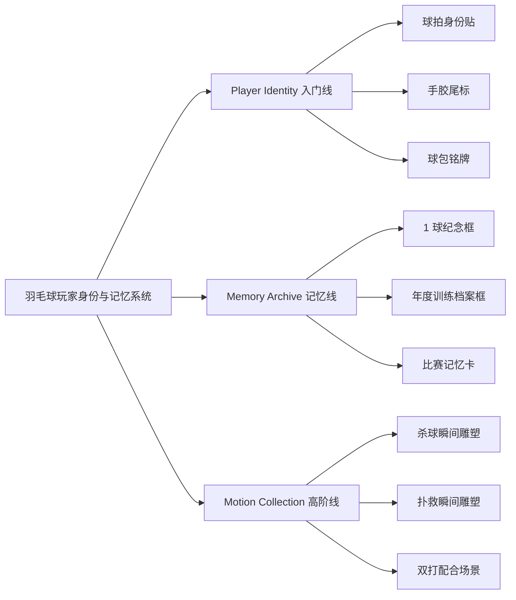
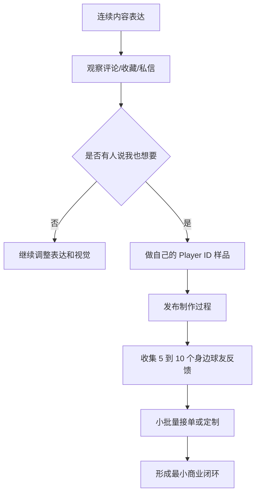

<title>羽毛球玩家个人身份与运动记忆品牌｜需求整理</title>

<callout emoji="✅">
**核心结论：**这个项目不应被定义为“羽毛球周边”或“球头相框”，而应被定义为“羽毛球玩家的个人身份与运动记忆系统”。第一阶段先用低成本内容和 Player ID 实验验证共鸣，再逐步进入球头收藏框、运动瞬间 3D 打印等高情绪价值产品。
</callout>

# 1. 项目起点

最初的灵感来自网上看到的羽毛球球头相框：把打坏的球头收集起来，放进画框里。但现有作品普遍显得密集、杂乱、廉价，像“把废品排列整齐”，有纪念意义，却缺少审美价值和收藏价值。

真正值得保留的不是球头本身，而是球头背后的那场球、那个搭子、那个比分、那个阶段的训练和热爱。

<grid>
<column width-ratio="0.500000">
### 不要做成
- 羽毛球周边店
- DIY 手工店
- 废物利用小店
- 密集球头收纳框
</column>
<column width-ratio="0.500000">
### 应该升级为
- 运动记忆收藏品牌
- 羽毛球玩家身份表达品牌
- 可展示的热爱
- 个人运动档案系统
</column>
</grid>

---

# 2. 核心洞察

羽毛球不是一次性运动消费，而是长期、持续、带身份感的热爱消费。长期打球的人会持续投入场地费、球、球拍、球鞋、手胶、球线，也会研究磅数、平衡点、手感和打法。

| 用户特征 | 说明 | 可转化机会 |
|-|-|-|
| 高频复购 | 球、手胶、球线、场地、装备长期消费 | 从低成本小物切入，如贴纸、尾标、球包牌 |
| 强个人属性 | 每个人都在意自己的配置、打法、手感 | 建立 Player ID 和个人装备识别系统 |
| 强圈层认同 | 像骑行、钓鱼、咖啡、键盘一样有自己的小宇宙 | 做内容、编号、标签、城市球友文化 |
| 强记忆沉淀 | 很多人会记得某场球、某个搭子、某次比赛 | 做球头收藏框、年度训练档案、动作雕塑 |

<callout emoji="💡">
**关键判断：**羽毛球行业的装备消费已经成熟，但文化收藏和个人身份表达几乎空白。这意味着小而美的品牌有机会定义一个新类别。
</callout>

---

# 3. 品牌定位

品牌要卖的不是“一个球头”“一卷手胶”“一张贴纸”，而是让玩家觉得：这是我的配置、我的打法、我的球场身份、我的热爱记忆。

> 品牌本质：把羽毛球热爱做成可保存、可展示、可识别的东西。

## 推荐主线

| 方向 | 表达 | 适合用途 |
|-|-|-|
| 中文名 | 留拍 | 有情绪、有东方感，适合小红书表达 |
| 英文名 | LAST SHOT | 运动感强，适合包装、产品线、视觉系统 |
| 品牌一句话 | 把热爱，留在这一拍 | 用于主页简介、包装卡片、内容结尾 |
| 长期定位 | 羽毛球玩家个人身份与运动记忆系统 | 用于商业计划、产品矩阵、品牌升级 |

---

# 4. 产品系统

产品可以分成两条线：低成本、易传播的身份表达线，以及高客单、高情绪价值的运动记忆收藏线。

## 产品方向拆解

| 产品 | 用户价值 | 启动难度 | 建议阶段 |
|-|-|-|-|
| Player ID 球拍贴纸 | 让球拍有自己的编号、标签和身份感 | 低 | MVP 第一优先级 |
| 手胶尾端标识 | 不改造手胶本体，也能形成强识别 | 低 | MVP 第一优先级 |
| 球包铭牌 | 像行李牌一样展示 Player ID、城市、打法 | 低到中 | MVP 第二优先级 |
| 1 球纪念框 | 把某一颗球做成“羽毛球记忆标本” | 中 | 内容验证后推出 |
| 年度训练档案框 | 用 12 个球头记录一年训练记忆 | 中到高 | 品牌感稳定后推出 |
| 3D 打印运动瞬间 | 把用户起跳杀球、扑救等动作实体化 | 高 | 高阶产品，后置验证 |

<callout emoji="❗">
**顺序建议：**先文化，再身份，再产品，再收藏。不要一开始就做复杂供应链、3D 打印和高客单产品。
</callout>

---

# 5. 最小商业闭环

第一阶段最重要的不是卖货，而是验证“羽毛球人是否愿意为身份感和记忆感产生共鸣”。

## MVP 方案：先从自己开始

- [ ] 给自己定义一个 Player ID，例如 ABU_21、RALLY_07、NETKILLER、27LBS

- [ ] 设计 3 个基础元素：球拍贴纸、球包铭牌、手胶尾端标识

- [ ] 用标签机、UV 贴纸、透明贴、金属贴、激光雕刻等低成本方式打样

- [ ] 拍摄球拍、手胶、贴纸、字体尝试和编号上身效果

- [ ] 发小红书记录“我突然开始想给自己的球拍建立身份系统了”

- [ ] 收集评论、收藏、私信和身边球友反馈

## 第一批样品建议

| 样品 | 内容 | 备注 |
|-|-|-|
| 球拍贴纸 | ABU_21 / 27LBS / RALLY NEVER ENDS | 贴在拍杆、拍锥、水壶或球包 |
| 手胶尾标 | 极简 Player ID 小标 | 先买普通黑色手胶，只改尾端视觉 |
| 球包铭牌 | Player ID、城市、打法标签、主拍 | 可用金属铭牌或亚克力小牌 |

---

# 6. 内容策略

小红书第一阶段不要像卖货，要像一个真正打羽毛球的人在观察、表达和实验。内容目标是让别人产生“你怎么知道我也是这样”的共鸣。

## 内容主线

<callout emoji="📝">
**主线：**把羽毛球热爱做成可保存的东西。
</callout>

## 30 天内容选题池

| 系列 | 选题示例 | 目的 |
|-|-|-|
| 记忆共鸣 | 每个羽毛球人都有一颗舍不得扔的球 | 验证情绪共鸣 |
| 身份表达 | 为什么打久了会想给自己的球拍编号 | 引出 Player ID |
| 装备人格化 | 羽毛球人消费的不是装备，而是自己的配置 | 建立观点 |
| 制作过程 | 我给自己的球拍做了一套身份系统 | 展示 MVP 样品 |
| 审美改造 | 为什么大多数球头相框看起来像废品堆叠 | 建立审美标准 |
| 未来想象 | 能不能把一次起跳杀球做成 3D 打印雕塑 | 铺垫高阶产品 |

---

# 7. 视觉风格要求

这个项目能否成立，审美很关键。要避免淘宝定制感、DIY 手工感、废物利用感，尽量向博物馆、黑胶、相机、北欧家居、小众潮牌靠近。

<grid>
<column width-ratio="0.500000">
### 必须避免
- 五颜六色
- 堆满、密集、杂乱
- 廉价木框
- 大字姓名印刷
- 过强 DIY 味
- 废物利用感
</column>
<column width-ratio="0.500000">
### 推荐方向
- 黑、白、银灰、胡桃木、透明亚克力
- 小字体、大留白、低饱和
- 编号感、档案感、标本感
- 克制、安静、专业
- 像收藏品，不像小商品
</column>
</grid>

## 球头收藏框设计原则

- 只展示 1 个、3 个、6 个或 9 个球头，不做密集墙。
- 每个球头下面记录日期、地点、对手、比分和一句话故事。
- 使用亚克力悬浮、胡桃木或铝合金框、激光铭牌。
- 把球头从“废球”升级成“运动记忆标本”。

---

# 8. 3D 打印运动瞬间方向

3D 打印动态雕塑是更高阶的产品线。它的价值不只是纪念球，而是把“人”的动作和瞬间实体化：起跳杀球、扑救、鱼跃、网前封网、双打轮转，都可以成为个人运动雕塑。

<callout emoji="⭐">
**判断：**3D 打印方向很有想象力，但不适合作为第一阶段 MVP。它需要用户信任、品牌调性和较强交付能力，建议在内容和 Player ID 验证后再做。
</callout>

| 输入 | 处理 | 输出 |
|-|-|-|
| 用户上传视频、连拍照片、慢动作 | 人体姿态识别、骨骼提取、动作关键帧、3D 重建 | STL 模型、渲染预览、3D 打印雕塑 |
| 比赛日期、地点、比分、故事 | 生成底座铭牌和收藏卡信息 | 个人运动瞬间收藏品 |

---

# 9. 阶段路线图

| 阶段 | 目标 | 动作 | 验证信号 |
|-|-|-|-|
| Phase 1：内容共鸣 | 验证这套表达是否有人共鸣 | 连续发 30 天羽毛球记忆和身份感内容 | 收藏、评论、私信、“我也这样” |
| Phase 2：个人样品 | 做自己的 Player ID 系统 | 贴纸、手胶尾标、球包铭牌低成本打样 | 身边球友主动询问、想跟着做 |
| Phase 3：小批量定制 | 形成最小商业闭环 | 接 5 到 20 个定制单，验证价格和交付 | 有人愿意付费、复购或推荐 |
| Phase 4：记忆收藏产品 | 推出更有品牌感的收藏品 | 1 球纪念框、年度训练档案框 | 用户愿意讲故事、寄球、定制 |
| Phase 5：运动瞬间收藏 | 进入高客单产品线 | 3D 打印杀球瞬间、扑救瞬间、动态雕塑 | 用户愿意为“这是我”支付溢价 |

---

# 10. 当前待办

- [ ] 确定第一版 Player ID 命名规则和视觉风格。

- [ ] 为自己的球拍设计 3 套贴纸方案。

- [ ] 采购低成本材料：透明贴、金属贴、标签机纸、普通黑色手胶、球包小铭牌。

- [ ] 完成第一组样品拍摄，包括球拍、手胶尾标、球包铭牌。

- [ ] 写出第一条小红书笔记：“我突然开始想给自己的球拍建立身份系统了”。

- [ ] 连续发布 30 天内容，记录数据和反馈。

- [ ] 从身边 5 个球友开始收集定制意愿和价格反馈。

<callout>
**阶段性结论：**现在不需要公司、商标、工厂和完整 SKU。最重要的是先做出一种“羽毛球玩家会觉得帅、觉得这是自己”的感觉，并用内容持续验证它。
</callout>
