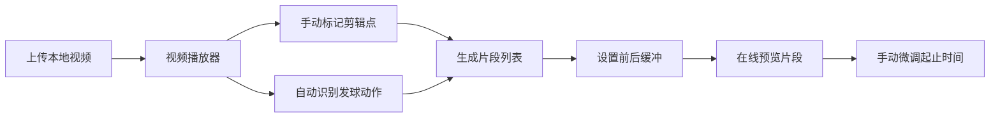
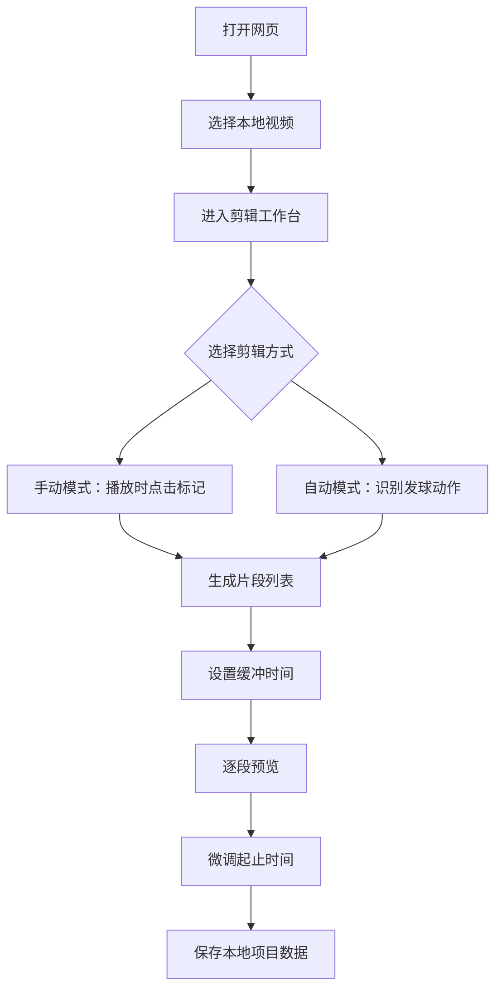
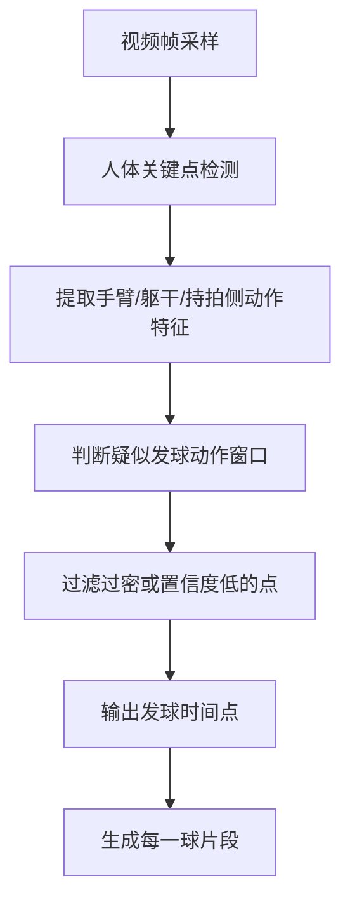
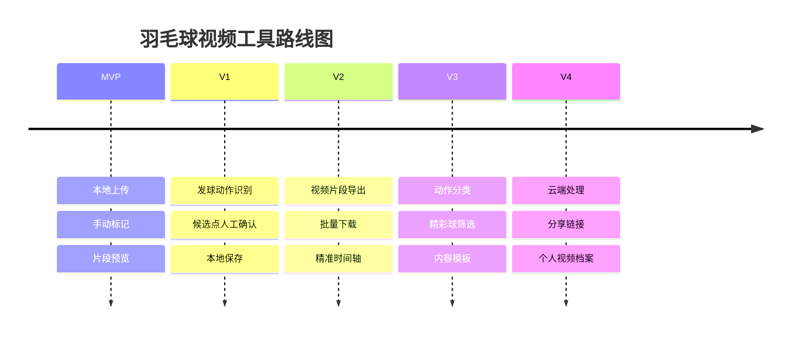

<title>羽毛球视频自动剪辑网页应用｜产品需求文档</title>

<callout emoji="✅">
**核心结论：**这个网页应用的第一阶段目标不是做复杂的视频平台，而是做一个本地运行的羽毛球视频切段工具：用户上传视频后，可以手动按秒标记剪辑点，也可以基于视觉识别“发球动作”自动切分每一球，并在网页内预览片段。
</callout>

# 1. 项目背景

用户长期打羽毛球，也拍摄了大量训练和比赛视频。但每次复盘或发内容时，都需要手动拖动进度条，把每一球一点点切出来，过程非常耗时。

这个工具要解决的核心痛点是：把一整段羽毛球视频快速拆成多个“单球片段”，让用户可以更容易复盘、挑选精彩球、制作小红书或短视频内容。

<grid>
<column width-ratio="0.500000">
### 现在的问题
- 每一球都要人工看视频、找起点、找终点。
- 长视频复盘成本高，用户容易放弃整理。
- 精彩球分散在整段视频中，很难快速定位。
- 剪辑工具太通用，不懂羽毛球场景。
</column>
<column width-ratio="0.500000">
### 希望达到
- 上传一段视频，自动拆出每一球。
- 用户可以按秒级调整每个片段。
- 片段可以直接在线预览。
- 初期数据只保存在本地，不做账号和云存储。
</column>
</grid>

---

# 2. 产品定位

这不是一个完整剪辑软件，也不是视频社区，而是一个针对羽毛球场景的“自动切球工具”。第一阶段要尽量小，先把单个关键流程做顺。

| 维度 | 定位 | 说明 |
|-|-|-|
| 目标用户 | 爱拍羽毛球视频的普通玩家 | 包括训练复盘、比赛记录、小红书内容创作者 |
| 核心场景 | 把一整段视频拆成每一球片段 | 重点识别发球动作，因为发球代表一球开始 |
| 第一阶段形态 | 网页应用 | 用户在浏览器上传本地视频，处理过程尽量在本地完成 |
| 第一阶段交付 | 在线预览版 | 暂不做云存储、账号系统、分享链接和正式下载链路 |

> 第一版要验证的是：用户是否愿意用网页工具快速得到“每一球片段列表”。

---

# 3. MVP 功能范围

MVP 只做最必要的闭环：上传视频、播放视频、手动标记、自动识别发球、生成片段、预览片段、调整缓冲时间。



## 第一版必须支持

- [ ] 用户上传本地视频文件。

- [ ] 页面内播放、暂停、拖动进度条、倍速播放。

- [ ] 用户点击按钮记录当前时间点，生成手动剪辑标记。

- [ ] 用户可以按秒编辑每个片段的开始时间和结束时间。

- [ ] 用户可以设置切片前后缓冲时间，例如前 0.5 秒、后 1 秒。

- [ ] 自动模式基于视觉识别发球动作，输出疑似发球时间点。

- [ ] 根据相邻发球点切分成多个片段。

- [ ] 片段列表支持点击预览。

- [ ] 剪辑过程数据保存在浏览器本地。

## 第一版暂不支持

- 账号登录。
- 云端上传和云端存储。
- 分享链接。
- 正式视频导出和下载。
- 音频识别，因为羽毛球现场录音通常嘈杂。
- 复杂动作分类，例如杀球、吊球、平抽、扑球。

---

# 4. 用户操作流程

用户路径要尽量直接，避免让用户像使用专业剪辑软件一样学习复杂概念。



| 步骤 | 用户动作 | 系统反馈 |
|-|-|-|
| 1 | 上传本地视频 | 读取视频元数据，展示时长、文件名、播放器 |
| 2 | 选择手动或自动模式 | 展示对应工具栏和操作按钮 |
| 3 | 设置缓冲时间 | 所有生成片段自动带入缓冲 |
| 4 | 生成片段列表 | 按编号展示每一球片段、起止时间、时长 |
| 5 | 点击片段预览 | 播放器跳转到该片段并只播放当前片段范围 |
| 6 | 手动微调时间 | 片段列表实时更新，预览范围同步变化 |

---

# 5. 核心功能说明

## 5.1 视频播放器

播放器是工作台核心，需要支持精准定位和重复预览。

| 能力 | 要求 |
|-|-|
| 基础播放 | 播放、暂停、拖动进度、显示当前时间和总时长 |
| 倍速播放 | 支持 0.5x、1x、1.5x、2x，用于快速找球 |
| 精细跳转 | 支持按秒或小步长前后移动，方便修剪边界 |
| 片段预览 | 点击片段后跳到开始时间，到结束时间自动暂停或回到片段起点 |

## 5.2 手动剪辑

手动剪辑是自动识别不稳定时的兜底能力，也适合作为第一版最快可用功能。

- 用户播放视频时点击“标记发球点”，系统记录当前秒数。
- 多个发球点按时间排序。
- 相邻两个发球点之间形成一个片段。
- 最后一个发球点到视频结尾形成最后一个片段。
- 用户可以删除、移动、重命名片段。

## 5.3 自动剪辑

自动剪辑第一阶段只识别“发球动作”。因为发球天然代表一球开始，比识别整场所有击球动作更容易形成稳定规则。

| 目标 | 说明 |
|-|-|
| 识别对象 | 球员发球动作，而不是所有击球动作 |
| 输出结果 | 一组疑似发球时间点 |
| 切分规则 | 从一个发球点到下一个发球点之前，视为一球片段 |
| 用户控制 | 用户可以删掉误识别点，也可以补充漏识别点 |

## 5.4 缓冲时间

用户可以设置每个片段的前后缓冲，避免切得太生硬。

| 设置项 | 默认值 | 说明 |
|-|-|-|
| 前置缓冲 | 0.5 秒 | 片段开始时间向前延伸，不能小于视频开始时间 |
| 后置缓冲 | 1 秒 | 片段结束时间向后延伸，不能超过视频结束时间 |
| 编辑方式 | 输入框或滑块 | 支持按 0.1 秒或 0.5 秒步进调整 |

---

# 6. 自动识别技术方案

用户明确不希望第一版基于声音，因为拍摄环境通常嘈杂。因此自动识别优先走视觉路线，并以人体动作识别为核心。



## 推荐实现层级

| 层级 | 方案 | 适合阶段 |
|-|-|-|
| Level 1 | 前端本地抽帧 + 人体关键点检测 + 简单规则判断发球 | 第一版原型 |
| Level 2 | 加入时序窗口，判断一段动作是否符合发球模式 | 可用版 |
| Level 3 | 收集真实视频后训练或微调动作识别模型 | 精度优化阶段 |
| Level 4 | 结合球拍、羽毛球轨迹、场地线辅助判断 | 高级版 |

<callout emoji="❗">
**实现建议：**第一版不要追求一次性全自动精准。应该把自动识别结果设计成“可编辑的候选发球点”，让用户能快速确认、删除和补点。
</callout>

## 候选技术

- MediaPipe Pose：适合浏览器端人体关键点检测。
- TensorFlow.js：适合前端运行轻量模型。
- OpenCV.js：适合做基础视觉处理和帧分析。
- FFmpeg.wasm：后续可用于本地切片导出，但第一版可先只做预览。
- IndexedDB：保存本地项目数据和剪辑点数据。

---

# 7. 页面结构建议

网页第一屏就应该是工具本身，不做营销落地页。用户打开后直接进入上传和剪辑工作台。

| 区域 | 内容 | 交互重点 |
|-|-|-|
| 顶部栏 | 项目名、当前视频名、本地保存状态 | 保持简洁，不做复杂导航 |
| 左侧主区域 | 视频播放器和时间轴 | 播放、暂停、拖动、倍速、跳秒 |
| 右侧工具栏 | 手动标记、自动识别、缓冲时间设置 | 让用户快速生成片段 |
| 底部区域 | 片段列表 | 预览、编辑起止时间、删除、重命名 |

## 片段列表字段

- 片段编号，例如第 1 球、第 2 球。
- 开始时间。
- 结束时间。
- 片段时长。
- 来源：手动标记或自动识别。
- 置信度：仅自动识别片段展示。
- 操作：预览、编辑、删除。

---

# 8. 数据与本地存储

第一版所有过程数据只存在本地，降低后端复杂度，也避免用户视频上传带来的隐私和成本问题。

| 数据类型 | 存储内容 | 建议方式 |
|-|-|-|
| 视频引用 | 文件名、大小、时长、浏览器临时 URL | 内存 + File API |
| 项目配置 | 前置缓冲、后置缓冲、播放速度偏好 | localStorage |
| 发球点 | 时间点、来源、置信度、是否被用户确认 | IndexedDB |
| 片段列表 | 起止时间、名称、来源、编辑状态 | IndexedDB |

<callout emoji="💡">
**边界提醒：**如果后续要做在线下载、云端处理或分享链接，就会进入后端、存储、队列、转码成本和隐私合规问题。MVP 阶段先不要引入。
</callout>

---

# 9. Cursor 实现拆分建议

如果交给 Cursor 开发，可以按模块拆，而不是一次性让它生成完整复杂系统。

| 任务 | 目标 | 验收方式 |
|-|-|-|
| 任务 1：搭建工作台 UI | 完成上传区、播放器、工具栏、片段列表布局 | 上传视频后能正常播放 |
| 任务 2：手动标记功能 | 点击按钮记录当前时间点并生成片段 | 用户能手动创建、删除、编辑片段 |
| 任务 3：缓冲时间功能 | 前后缓冲影响片段起止时间 | 调整缓冲后片段范围实时更新 |
| 任务 4：片段预览功能 | 点击片段后只播放对应区间 | 播放到片段结束自动暂停 |
| 任务 5：本地保存 | 保存发球点和片段列表 | 刷新页面后仍可恢复项目数据 |
| 任务 6：自动识别原型 | 接入人体关键点检测，输出候选发球点 | 识别结果进入片段列表，可人工修正 |

## 给 Cursor 的初始实现提示

```text
请实现一个羽毛球视频自动剪辑网页应用的 MVP。第一阶段只做前端本地应用，不做账号、后端、云存储和下载。核心功能包括：上传本地视频、HTML5 video 播放器、手动标记发球点、根据发球点生成片段列表、设置前后缓冲时间、点击片段预览、编辑和删除片段、本地保存项目数据。自动识别先预留模块接口，后续接入 MediaPipe Pose 或 TensorFlow.js 输出候选发球点。
```

---

# 10. 验收标准

| 验收项 | 通过标准 |
|-|-|
| 视频上传 | 用户选择本地视频后，页面能正常显示并播放 |
| 手动标记 | 用户点击标记按钮后，当前时间点被记录 |
| 片段生成 | 多个发球点能自动生成多个片段 |
| 缓冲设置 | 修改缓冲时间后，片段开始和结束时间正确变化 |
| 片段预览 | 点击任意片段可以播放该片段范围 |
| 手动修正 | 用户可以编辑起止时间、删除片段、补充发球点 |
| 本地保存 | 刷新后能恢复最近一次剪辑配置和片段数据 |
| 自动识别接口 | 即使模型暂未完善，也要有候选发球点输入和展示机制 |

---

# 11. 后续规划

当 MVP 跑通后，再逐步加更复杂的能力。不要一开始就把所有路线都塞进第一版。



## 未来能力池

- 支持导出剪辑后的视频片段。
- 支持批量下载片段。
- 支持识别杀球、扑救、多拍、得分回合等动作。
- 支持自动生成小红书或短视频素材包。
- 支持把精彩球和 Player ID、运动记忆品牌体系结合。
- 支持从视频中提取用户的动作瞬间，为 3D 打印运动雕塑做前置数据。

<callout>
**最终判断：**这个网页工具可以成为羽毛球商业想法里的一个“内容生产基础设施”。它先帮玩家更轻松地整理每一球，后续可以连接复盘、精彩球、运动记忆收藏、Player ID 和 3D 打印动作瞬间。
</callout>
