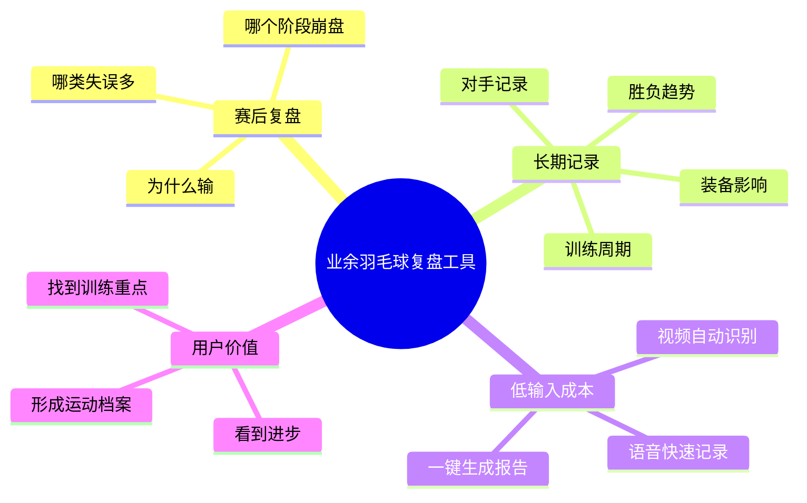
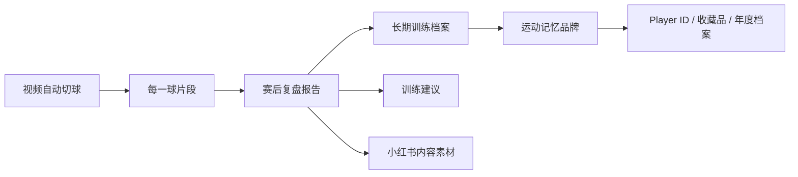
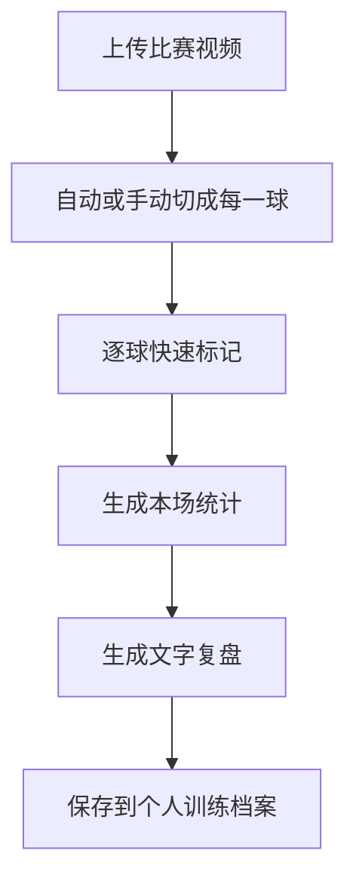

<title>羽毛球赛后复盘与训练记录工具｜创业机会整理</title>

<callout emoji="✅">
**核心结论：**这份材料里羽毛球方向没有被评为“本周最强机会”，但它暴露出一个值得持续验证的需求：业余羽毛球玩家打完球后，很难低成本知道自己为什么输、哪里在进步、训练是否有效。这个方向适合与前面的“视频自动切球工具”“Player ID / 运动记忆品牌”合并成一条更完整的产品线。
</callout>

# 1. 来源与背景

原始对话是一份“创业机会挖掘分析”，目标是从 Reddit 近 7 天用户抱怨里寻找产品机会。最终入选的主机会是 AI 工作上下文层，但其中有一组羽毛球/业余运动相关需求，被归类为备选机会。

这份整理只提取其中和羽毛球、运动训练记录、赛后复盘相关的部分，并重新组织成一份可继续验证和落地的机会文档。

<callout emoji="❗">
**重要边界：**以下 Reddit 证据来自原始导出文件中的归纳，不是本次重新实时抓取。原分析也明确指出：羽毛球方向“问题真实，但样本证据密度还不够”。
</callout>

---

# 2. 被发现的羽毛球相关抱怨

原始材料中与羽毛球/业余运动相关的抱怨主要集中在三个点：赛后不知道为什么输、长期进步难以记录、训练跟踪工具不贴近真实使用。

| 抱怨 | 用户场景 | 当前方案 | 不满意原因 |
|-|-|-|-|
| 打完羽毛球，不知道自己为什么输 | 业余对局后想复盘表现 | 凭感觉回忆，或自己做 live tracking | 实时记录太费劲，难以长期坚持 |
| 想记录比赛，但没有简单办法看长期进步 | 记录胜负、对手、装备、表现趋势 | 不记，或零散记录 | 数据分散，无法形成长期趋势 |
| 俱乐部级运动员缺少好用训练跟踪工具 | 没有专业体能团队支持的运动员训练管理 | 自己用 Notion 搭系统 | 通用工具不贴合训练节奏，维护成本高 |

## 原始证据链接

- r/badminton 新帖流：[https://www.reddit.com/r/badminton/new/](https://www.reddit.com/r/badminton/new/)
- r/Notion 新帖流：[https://www.reddit.com/r/Notion/new/](https://www.reddit.com/r/Notion/new/)

---

# 3. 问题聚类

原始材料把这类需求归纳为“运动训练记录和复盘缺工具，但证据密度还不够”。这句话非常关键：方向不是没价值，而是还需要继续找真实用户和真实数据验证。

| 维度 | 判断 | 说明 |
|-|-|-|
| 核心问题 | 赛后复盘和长期记录输入成本太高 | 用户想知道怎么进步，但不愿意一边打球一边复杂记录 |
| 主要用户 | 羽毛球爱好者、俱乐部运动员、训练型玩家 | 尤其是每周固定打球、愿意研究装备和打法的人 |
| 当前替代方案 | 凭感觉复盘、手工记表、Notion、自建表格 | 工具不难找，但难坚持 |
| 需求强度 | 中需求，待验证 | 痛点真实，但还要验证是否愿意付费 |
| AI 适配度 | 高 | 视频识别、动作分析、语音总结、自动报告都适合 AI |
| MVP 适配度 | 适合 | 可以从极窄场景开始，不必一上来做完整训练平台 |

---

# 4. 机会判断

这个方向的商业价值不在“大而全运动训练平台”，而在一个更小的切口：让羽毛球玩家用很低的输入成本，得到一次对局的结构化复盘。

<grid>
<column width-ratio="0.500000">
### 为什么值得继续看
- 你本人就是目标用户，更容易理解真实使用场景。
- 羽毛球玩家本来就愿意为热爱持续付费。
- 现有记录方式太手工，长期坚持难。
- 可以和视频自动剪辑、运动记忆品牌自然连接。
- AI/视觉能力能明显降低记录成本。
</column>
<column width-ratio="0.500000">
### 为什么不能直接重仓
- 原始 Reddit 样本只有 3 个高相关帖子，证据密度不足。
- 用户嘴上想复盘，不代表愿意持续记录或付费。
- 纯数据工具容易变成用两次就放弃的仪表盘。
- 动作识别和胜负归因的准确度要求会逐步变高。
- 需要先找到最小高频动作，不要一开始做训练平台。
</column>
</grid>

<callout emoji="💡">
**更准确的机会描述：**不是“做一个羽毛球记录 App”，而是“把打完一场球后的复盘成本降到最低”。
</callout>

---

# 5. 与现有三个羽毛球方向的关系

你之前已经沉淀了三个相关方向：运动记忆品牌、视频自动剪辑网页工具、Player ID/个人身份系统。这个“赛后复盘工具”可以成为连接它们的产品基础设施。

| 已有方向 | 与本机会的关系 | 可形成的组合 |
|-|-|-|
| 羽毛球视频自动剪辑 | 提供每一球片段，是复盘的输入层 | 自动切球 + 标记胜负/失误 |
| 运动记忆品牌 | 把复盘数据沉淀成个人运动档案 | 年度训练档案、代表性比赛收藏 |
| Player ID 系统 | 把用户身份、打法、装备和数据绑定 | Player ID + 对局记录 + 成长趋势 |
| 3D 打印运动瞬间 | 从视频中提取关键动作和高光片段 | 精彩球片段 + 动作定格 + 实体纪念 |

---

# 6. 建议产品方向

建议把产品方向命名为“羽毛球赛后复盘助手”，第一阶段不要做“训练管理系统”，而是做一次对局结束后的轻量复盘。

## 产品一句话

> 上传一段羽毛球视频，自动拆成每一球，并帮你快速标记输赢、失误类型和关键回合，生成一份赛后复盘报告。

## 核心用户

- 每周固定打羽毛球的业余玩家。
- 经常拍比赛或训练视频的人。
- 想提升水平，但不知道问题在哪里的人。
- 喜欢记录装备、搭子、比分和成长变化的人。

## 核心功能

| 功能 | 价值 | 第一版是否需要 |
|-|-|-|
| 视频自动切球 | 降低复盘入口成本 | 需要，可复用已有网页工具方向 |
| 每球快速标记 | 用最少输入记录胜负、失误、亮点 | 需要 |
| 赛后总结报告 | 把零散标记变成可读复盘 | 需要 |
| 长期趋势 | 观察一段时间的进步 | 后置 |
| AI 动作分析 | 自动识别失误和打法问题 | 后置，第一版不强求 |
| 教练反馈 | 连接真人教练或 AI 教练 | 后置 |

---

# 7. MVP 设计

最小版本不要追求“自动告诉你为什么输”，而是做一个能让用户快速完成赛后结构化记录的工具。

## 第一版只做

- [ ] 复用视频自动剪辑能力，把整段视频切成每一球。

- [ ] 给每一球加快捷标记：赢/输、主动得分/失误、网前/后场/接发/防守。

- [ ] 允许用户补充一句话备注，例如“反手被压住”“接发太高”。

- [ ] 自动汇总本场：总球数、得分球、失误球、主要失误类型。

- [ ] 生成一份可复制的小复盘：今天主要问题、下次训练重点、值得保留的高光球。

- [ ] 数据先存在本地，不做登录和云端。

## 第一版先不做

- 不做复杂 AI 教练。
- 不做多人对战平台。
- 不做场地预订、找搭子、赛事组织。
- 不做全自动失误识别。
- 不做训练计划商城。
- 不做 App，先做网页工具。

<callout emoji="❗">
**MVP 原则：**用户只要愿意在每球片段上点几下，就能得到一份比“凭感觉复盘”强很多的报告。
</callout>

---

# 8. 验证计划

这个方向目前最大的风险不是技术，而是需求强度和持续使用。建议先用内容和身边球友做低成本验证。

| 阶段 | 目标 | 动作 | 通过信号 |
|-|-|-|-|
| 验证 1：问题共鸣 | 确认大家是否真的想复盘 | 发小红书/朋友圈：“打完球你知道自己为什么输吗？” | 有人评论自己也不知道、想要模板或工具 |
| 验证 2：手工服务 | 确认复盘报告是否有价值 | 帮 3 到 5 个球友手工整理一场球 | 对方愿意转发、复看、提出下次还想用 |
| 验证 3：半自动工具 | 确认用户能接受逐球标记 | 做网页原型，让用户自己标记每球 | 用户愿意完成一整场，而不是中途放弃 |
| 验证 4：付费意愿 | 确认商业可能性 | 提供单场复盘报告或月度训练档案 | 有人愿意为一次复盘或一套档案付费 |

## 可以问用户的 5 个问题

1. 你打完球后会复盘吗？如果不复盘，最大的阻碍是什么？
2. 你最想知道的是“为什么输”，还是“哪里在进步”？
3. 如果每球只需要点 2 到 3 下，你愿意标记一整场吗？
4. 一份赛后复盘报告对你有价值吗？什么内容最有价值？
5. 你愿意为单场复盘、月度训练档案或年度运动档案付费吗？

---

# 9. 变现设想

变现不建议一开始做订阅。可以先从单次服务、模板、轻量工具或内容引流开始。

| 模式 | 说明 | 适合阶段 |
|-|-|-|
| 单场复盘报告 | 用户发视频，你输出一份结构化复盘 | 手工验证阶段 |
| 网页工具 Freemium | 免费切少量视频，高级统计或导出收费 | MVP 跑通后 |
| 月度训练档案 | 按月整理用户训练趋势和代表性片段 | 有复用用户后 |
| 教练协作 | 把片段和数据打包给教练看 | 后期 |
| 运动记忆商品 | 把高光球、年度档案、Player ID 做成实体收藏 | 品牌阶段 |

---

# 10. 当前结论

这份材料给出的判断很克制：羽毛球/业余运动赛后复盘方向是真机会，但当前公开证据还不够密，不适合立刻重仓为“本周最佳创业机会”。

不过，对你来说它值得继续推进，因为它和你的个人热爱、AI/视频能力、前面沉淀的羽毛球商业方向高度重合。

<callout>
**建议下一步：**不要先做完整产品。先用你自己的打球视频做一份“手工赛后复盘样稿”，再拿给身边球友看。如果他们看完第一反应是“我也想要一份”，这个方向就值得进入原型开发。
</callout>
