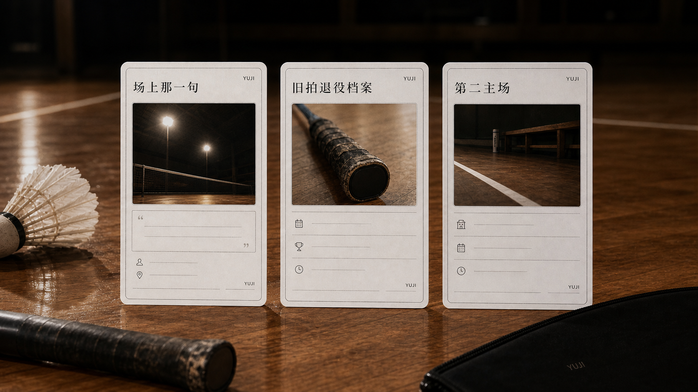

# 羽迹卡 MVP 产品雏形

创建日期：2026-06-11

## 核心定义

羽迹卡不是普通卡片，也不是低价定制海报。

它的第一阶段定义是：

> 把一个羽毛球人的某段热爱痕迹，做成一张可以保存、转发、展示的记忆凭证。

用户不是因为“想买一张卡”而行动，而是因为想留下某个真实场景：

- 一句一直记得的场上话。
- 一支舍不得扔的旧拍。
- 一个每周都会回去的球馆。
- 一个一直愿意多打一局的搭子。

所以前台表达不应先说“羽迹卡”，而应先说“我想帮你把这段羽毛球记忆留下来”。

## 第一阶段产品判断

现阶段不做商城、不做复杂下单表单、不做完整 Player ID 系统，也不急着做实体供应链。

第一阶段只验证三件事：

1. 用户是否愿意讲出自己的羽毛球记忆。
2. 用户是否愿意把这段记忆交给 YUJI 做成样稿。
3. 用户看到样稿后，是否出现“我也想要”“想发给搭子”“可以做成实体吗”这类反馈。

## 三种优先卡型

### 1. 场上那一句卡

记录球场上某个人说过、后来一直没有忘掉的一句话。

适合用户：

- 有固定搭子或固定球局的人。
- 记得某一句鼓励、提醒、调侃或接住自己的话的人。
- 不一定有高光成绩，但有关系记忆的人。

建议字段：

- 那句话是什么。
- 谁说的。
- 发生在哪一局或哪个球馆。
- 当时你怎么了。
- 为什么一直记到现在。

小红书测试入口：

> 球场上有没有一句话，你到现在还记得？我想免费帮 3 个球友，把那句话做成一张「场上那一句」记忆卡。

### 2. 旧拍退役档案

给一支旧拍、旧手胶、断线球拍或舍不得扔的装备一个体面的告别。

适合用户：

- 有旧拍、旧球、旧手胶、旧球包的人。
- 不是因为装备贵，而是因为它陪自己打过一段时间。
- 愿意提供照片和一句故事的人。

建议字段：

- 这支拍陪你多久。
- 最后一次认真用它是什么时候。
- 它身上最明显的痕迹是什么。
- 你为什么舍不得扔。
- 想对它说的一句话。

小红书测试入口：

> 你有没有一支舍不得扔的旧拍？我想帮它写一张退役档案。

### 3. 第二主场卡

记录一个普通球友反复回去的球馆、固定球局和归属感。

适合用户：

- 有常去球馆或固定场次的人。
- 觉得某一局人比场地本身更重要的人。
- 想把这张图发给同一局球友的人。

建议字段：

- 常去的球馆或场地。
- 最熟悉的是哪块地胶、哪盏灯、哪条路。
- 谁最常喊你补最后一局。
- 你为什么后来一直回来。
- 这一局对你意味着什么。

小红书测试入口：

> 你后来一直去的，不一定是最好的馆。有没有一个地方，像你的第二主场？

## 视觉方向

羽迹卡应像“运动记忆档案”，而不是宣传海报。

推荐方向：

- 克制、留白、档案感、收藏感。
- 黑、白、银灰、低饱和暖光。
- 真实球馆灯光、地胶反光、旧球、旧拍、手胶细节。
- 小字体、编号、字段、纸张或亚克力质感。

必须避免：

- 淘宝定制海报感。
- 大字姓名和夸张口号。
- 过度可爱、贴纸化、情侣礼品化。
- AI 炫技感。
- 奖状、证书、战绩榜、装备测评风。

## 概念图

第一版三联概念图：

图片用于内部产品理解和视觉方向讨论，不直接作为最终上架产品图。

## MVP 验证动作

当天最小动作：

1. 在一篇即将发布的小红书笔记结尾，只测试一个入口。
2. 优先测试“场上那一句卡”，因为用户输入门槛最低。
3. 免费名额控制在 3 个，不开放批量报名。
4. 只收集故事和授权，不报价。
5. 手工做出 1-3 张样稿后，再判断用户是否愿意转发、收藏、追问实体版本。

通过信号：

- 评论或私信出现 5 条以上具体场上话、旧拍故事或球馆归属故事。
- 至少 2 位用户愿意补充字段信息。
- 至少 1 位用户看到样稿后主动问“能不能也帮我做一张”或“能不能做实体”。

暂缓信号：

- 用户只点赞，不讲故事。
- 评论只讨论装备型号、球馆推荐或技术教学。
- 用户只把它理解成免费 P 图或低价定制。

## 当前产品结论

羽迹卡第一阶段不是一个售卖 SKU，而是 YUJI 的产品验证入口。

它要验证的不是“卡片能不能卖”，而是：

> 普通羽毛球人是否愿意把自己的热爱痕迹交给 YUJI 保存，并愿意把这份保存过的记忆转发给重要的人。
