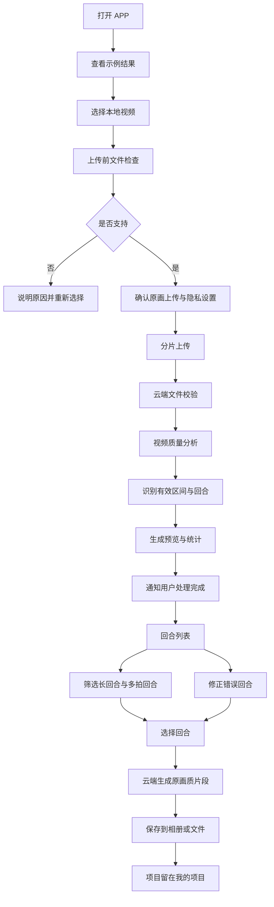

# 羽迹 V1 APP 用户流程与页面交互方案

创建日期：2026-07-19

状态：交互方案讨论稿，CEO 审核后进入线框原型与技术验证

## 1. 首版体验目标

首版只完成一个闭环：

> 用户上传一段羽毛球长视频，羽迹自动切出有效回合，帮助用户快速找到长回合和多拍回合，并以接近原始观看质量下载需要的片段。

首版成败不取决于页面数量或 AI 文案，而取决于：

- 用户是否顺利上传一段大视频。
- 用户是否能快速得到可用回合列表。
- 用户是否能在 10 秒内找到最长或最多拍回合。
- 用户是否能轻松修正错误边界。
- 用户是否能顺利拿走原画质片段。

## 2. 首版完整用户流程



## 3. 一级信息架构

首版底部导航只保留三个入口：

1. `首页`
2. `上传`
3. `我的`

以下均为流程页，不进入底部导航：

- 示例项目。
- 上传前检查。
- 上传与处理任务。
- 质量结果。
- 回合列表。
- 回合修正。
- 统计详情。
- 下载任务。
- 项目管理。

## 4. 页面一：首页

### 页面目标

让首次用户在上传几 GB 视频之前清楚理解：

- 上传什么。
- 羽迹会产出什么。
- 为什么值得等待。
- 最终能否下载原画质片段。
- 视频如何保存和删除。

### 首屏结构

1. YUJI / 羽迹品牌标识。
2. 一句话价值。
3. 主上传按钮。
4. 一张真实示例结果卡。

建议文案：

> 一场球太长，精彩回合太难找  
> 上传比赛视频，羽迹自动切出每个回合

辅助说明：

> 自动筛选 30 秒以上、10 拍以上回合，支持原画质片段下载

主按钮：

> 上传我的视频

### 示例结果卡

示例直接展示结果，不先解释算法：

- 原视频：58 分钟。
- 有效打球：19 分钟。
- 回合：42 个。
- 30 秒以上：5 个。
- 精确 10 拍以上：8 个。
- 疑似 10 拍以上：4 个。
- 最长回合：47 秒。

按钮：

> 查看示例回合

示例项目与真实项目共用回合列表界面，但隐藏修正、删除和批量下载。

### 回访用户状态

首页顶部优先展示最近任务：

- 正在上传。
- 等待 Wi-Fi。
- 排队处理中。
- 正在识别回合。
- 等待用户确认。
- 已完成。
- 处理失败。

任务卡主按钮随状态变化：

- `继续上传`
- `查看进度`
- `确认回合`
- `查看结果`
- `重新处理`

### 首页异常

- 无网络：仍可查看已缓存项目。
- 服务维护：禁止新上传，但允许浏览已有结果。
- 未登录：可以浏览示例，点击上传时再登录。

## 5. 页面二：视频选择与上传前检查

### 页面目标

用户选择视频后，不立即上传。先展示文件条件、风险、等待时间和隐私规则。

### 页面字段

- 视频封面。
- 文件名。
- 时长。
- 文件大小。
- 分辨率。
- 帧率。
- 编码和格式。
- 是否包含现场音频。
- 预计上传时间。
- 预计处理时间范围。
- 原片默认删除时间说明。

### 首版上传方式

首版只提供：

> 原画上传

不提供容易混淆的“智能压缩上传”。产品必须保持用户对原画质下载的稳定预期。

说明文案：

> 羽迹会上传原始视频，用于生成保持原始分辨率和观看质量的回合片段。系统会另外生成低码率版本用于分析和预览。

### 上传前轻检查

本地可以直接判断：

- 是否超过 90 分钟。
- 是否超过 6GB。
- 是否低于 720p 或 24fps。
- 格式和编码是否支持。
- 是否有读取权限。
- 云相册文件是否已下载到本地。
- 当前网络是否为移动网络。

本地不能可靠判断完整场地、遮挡和球员大小时，不假装已经完成质量分析；这部分在云端代理视频生成后判断。

### 主操作

- `开始上传`
- `重新选择`
- `查看拍摄要求`
- `仅在 Wi-Fi 下上传`

### 隐私设置

默认设置：

- 视频仅自己可见。
- 原片从首次成功生成结果起保留 7 天。
- 不允许用于模型优化。
- 不允许公开展示。

模型优化和公开展示必须分别授权，不能合并成一个复选框。

### 阻断与警告

阻断：

- 文件损坏或无法读取。
- 格式无法解码。
- 超过首版硬限制。

警告但允许继续：

- 竖屏。
- 无音频。
- 720p。
- 文件较大且使用移动网络。

## 6. 页面三：上传与处理任务

### 页面目标

让长任务可以离开、恢复、解释和重试，不让用户一直停留在页面等待。

### 任务状态模型

每个任务同时保存：

- 业务阶段：上传、校验、质量分析、回合识别、预览生成、等待确认、完成。
- 健康状态：正常、暂停、等待网络、失败、需要用户操作、已取消。

### 上传阶段展示

- 已上传容量 / 总容量。
- 真实分片进度。
- 当前上传速度。
- 预计剩余时间，明确使用“约”。
- 当前网络类型。
- 暂停、继续和取消。

文案：

> 正在上传原视频。你可以离开当前页面，重新打开羽迹后会从已完成进度继续。

不能承诺 APP 被系统彻底关闭后一定持续上传。正确说明：

> 受手机系统限制，长时间处于后台时上传可能暂停，重新打开后会自动续传。

### 上传完成后的阶段

1. 上传完成，正在校验视频完整性。
2. 正在生成分析版本。
3. 正在检查场地、画质和音频。
4. 正在寻找有效比赛画面。
5. 正在识别每个回合。
6. 正在估算击球拍数。
7. 正在生成回合预览。
8. 处理完成，等待查看结果。

模型处理不展示虚假的精确百分比，只展示：

- 当前阶段。
- 已运行时间。
- 大致等待范围。
- 是否排队。
- 完成后通知。

### 失败恢复

系统原因：

> 处理暂时中断，羽迹将从“回合识别”步骤继续，无需重新上传。

用户文件原因：

> 视频无法正常解码，需要重新选择文件。此次失败不会消耗分析额度。

场景不适合：

> 画面中没有稳定检测到羽毛球场地，无法生成可靠回合。你可以查看拍摄建议或仍尝试基础切分。

## 7. 页面四：质量结果

### 页面目标

在用户看到回合结果前，解释该视频能做到什么以及哪些结果可能不稳定。

### 质量等级

- `适合完整切分`
- `可以基础切分`
- `暂不适合自动切分`

不使用抽象总分作为唯一信息。

### 检测维度

- 场地是否长期可见。
- 机位是否稳定。
- 球员是否过小或严重遮挡。
- 亮度和清晰度。
- 是否频繁移动或切镜。
- 音频是否可辅助计拍。
- 可分析时间占比。

示例：

> 可以基础切分  
> 主要回合能够识别，但后半段有约 6 分钟遮挡，部分拍数只能估算

主按钮：

- `查看回合结果`
- `仍然尝试切分`
- `删除并重新上传`
- `查看拍摄建议`

## 8. 页面五：回合列表

### 页面目标

这是首版主产品页面。用户需要快速完成：

1. 看见切出了多少回合。
2. 找到长回合和多拍回合。
3. 播放、收藏、修正和下载。

### 顶部摘要

- 原视频总时长。
- 可分析时长。
- 有效打球时长。
- 回合总数。
- 30 秒以上数量。
- 精确 10 拍以上数量。
- 疑似 10 拍以上数量。
- 最长回合。
- 拍数最多回合或疑似拍数最多回合。

示例文案：

> 这段 62 分钟的视频中，羽迹识别出 47 个完整回合，有效打球时间为 21 分钟

### 筛选和排序

筛选：

- 全部。
- 30 秒以上。
- 10 拍以上。
- 疑似 10 拍以上。
- 已收藏。
- 待确认。

排序：

- 按原视频顺序，默认。
- 按时长。
- 按拍数。

### 回合卡片

每张卡片显示：

- `回合 001`
- 原视频位置，例如 `03:12—03:37`
- 时长，例如 `25 秒`
- 拍数状态：`14 拍`、`约 14 拍`、`拍数待确认`或`暂无拍数`
- 缩略图。
- 回合状态：已识别、待确认、已修正。
- 标签：30 秒以上、10 拍以上、疑似 10 拍以上。
- 播放、收藏、选择、修正和下载。

前台不展示 `0.73` 等模型置信度数字。

### 空状态

- 没有回合：允许从原视频手动新增。
- 没有 30 秒以上：正常说明，不制造遗憾文案。
- 拍数不可用：仍允许按时长筛选和下载。
- 原片已删除：可以播放已有预览，但不能重新调整或生成新的原画质片段。

## 9. 页面六：回合修正

### 页面目标

提供最低学习成本的回合级修正，不发展为完整剪辑软件。

### 页面结构

- 视频播放器。
- 当前回合循环播放。
- 简化时间轴。
- 开始和结束手柄。
- 前后 2—3 秒上下文。
- 当前语义时长。
- 当前拍数状态。
- 保存修正。

### 首版操作

- 调整开始时间。
- 调整结束时间。
- 以 0.1 秒或 0.5 秒微调。
- 删除误识别回合。
- 拆成两个回合。
- 与上一或下一回合合并。
- 从原视频手动新增回合。
- 修正拍数。
- 恢复自动结果。

避免使用“入点、出点、轨道、磁吸”等专业剪辑术语。

### 修正后的系统行为

- 重新计算回合时长。
- 重新判断 30 秒以上标签。
- 重新估算拍数。
- 更新 10 拍以上状态。
- 只重新生成受影响回合的预览和原画片段。

## 10. 页面七：统计详情

### 页面目标

展示视频结构，不做胜负和技术评价。

### 首版统计

- 原视频总时长。
- 可分析时长。
- 有效打球时长。
- 完整回合数。
- 疑似完整回合数。
- 平均回合时长。
- 最长回合。
- 30 秒以上数量和占比。
- 精确拍数覆盖回合数。
- 估算拍数覆盖回合数。
- 精确 10 拍以上数量。
- 疑似 10 拍以上数量。
- 拍数最多回合。
- 回合时长分布。
- 拍数分布。

时长分布：

- 0—10 秒。
- 10—20 秒。
- 20—30 秒。
- 30 秒以上。

拍数分布：

- 1—5 拍。
- 6—9 拍。
- 10—19 拍。
- 20 拍以上。

拍数不可用时不展示零值图表，而显示：

> 本视频暂时无法可靠估算拍数，你仍可按回合时长筛选和下载

## 11. 页面八：原画质下载

### 页面目标

让用户清楚选择下载内容、等待生成，并顺利保存到手机。

### 下载入口

- 回合卡单个下载。
- 勾选多个回合。
- 全选当前筛选结果。
- 一键选择全部 30 秒以上。
- 一键选择全部精确或疑似 10 拍以上。
- 下载全部回合。

### 首版输出

- 单个原画质 MP4 片段。
- 多个回合云端异步打包 ZIP。
- 保存到相册。
- 保存到系统文件。
- 分享给其他应用。

合并成一个集锦视频放在 P1，不进入首版。

### 文件命名

```text
羽迹_项目名_回合001_32秒_14拍.mp4
羽迹_项目名_回合002_28秒_约11拍.mp4
```

### 生成状态

- 等待生成。
- 原画切片中。
- 批量打包中。
- 准备下载。
- 下载中。
- 已保存。
- 部分成功。
- 原片不可用。

批量打包完成后提供有有效期的下载链接，并展示文件数、预计大小和到期时间。

### 原画质文案

> 羽迹会尽量保留源视频的分辨率、帧率和观看质量，不主动降低清晰度。个别格式为实现精确切点，可能进行无明显画质损失的重新编码。

## 12. 页面九：我的项目

### 页面目标

管理所有视频任务、结果、下载和存储期限。

### 项目卡字段

- 项目封面和名称。
- 上传日期。
- 原视频时长。
- 回合数。
- 30 秒以上数量。
- 10 拍以上和疑似数量。
- 当前任务状态。
- 原片删除倒计时。
- 已下载片段数。

### 项目状态

- 等待上传。
- 上传中。
- 上传暂停。
- 排队中。
- 处理中。
- 等待确认。
- 已完成。
- 失败待重试。
- 原片即将删除。
- 原片已删除，仅保留结果。

### 项目管理

- 修改项目名。
- 继续上传或处理。
- 重新分析。
- 下载原视频，保留期内。
- 删除原视频但保留结果。
- 删除整个项目。
- 查看授权和保存期限。
- 反馈识别问题。

两级删除：

> 删除原视频：保留已有预览和统计，但不能重新调整边界或生成新的原画质片段

> 删除整个项目：删除原视频、片段、预览和统计，无法恢复

## 13. 通知

首版通知：

- 上传因网络暂停。
- 上传完成。
- 视频不适合自动切分。
- 回合识别完成。
- 原画质片段生成完成。
- 处理失败，需要用户操作。
- 原视频将在 24 小时后删除。

完成通知示例：

> 你的比赛视频已经切好了：共识别 47 个回合，其中 5 个超过 30 秒

## 14. 首版交互验收主路径

使用一段约 60 分钟、2GB 的真实比赛视频验收：

1. 用户从手机相册选择视频。
2. 上传前看到时长、大小、画质和保存规则。
3. 上传中退出页面，任务可以恢复。
4. 上传完成后文件校验成功。
5. 处理期间展示真实阶段，不展示虚假百分比。
6. 完成后收到通知。
7. 用户查看视频质量说明。
8. 回合列表成功生成。
9. 用户筛选全部 30 秒以上回合。
10. 用户分别查看精确和疑似 10 拍以上回合。
11. 用户修正一个切早、切晚、误合并或漏检回合。
12. 修改后统计同步更新。
13. 用户选择多个回合生成原画质片段。
14. 用户保存到相册或系统文件。
15. 用户在我的项目重新找到结果。
16. 用户可以删除原视频或整个项目。

## 15. 首版禁止的虚假体验

- 用循环动画假装模型已有精确进度。
- 承诺 APP 关闭后上传一定继续。
- 从代理视频导出却称为原画质。
- 把估算拍数写成精确拍数。
- 没有胜负数据却生成胜率或输球原因。
- 系统失败后要求用户重新上传整个文件。
- 回合识别错误但不给用户修正能力。
- 删除只改数据库状态，不清理对象存储和派生文件。
- 云端打包未完成却展示可点击下载按钮。
- 为了看起来智能，生成与视频证据无关的模板化分析。

## 16. 下一步

本交互方案经 CEO 审核后，下一步不是直接开发完整 APP，而是：

1. 绘制首页、上传、任务、回合列表、修正和下载六个核心页面的低保真线框。
2. 使用一段真实视频制作可点击交互原型。
3. 同步验证 Flutter 原画大视频上传、断点续传和后台恢复。
4. 制作人工标注的真实回合列表和统计结果，验证信息是否足够有价值。
5. 交互与技术验证通过后，再拆正式 PRD 和开发任务。

