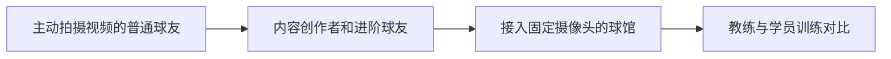
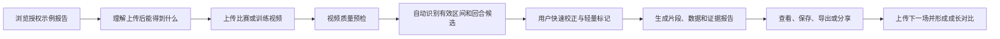
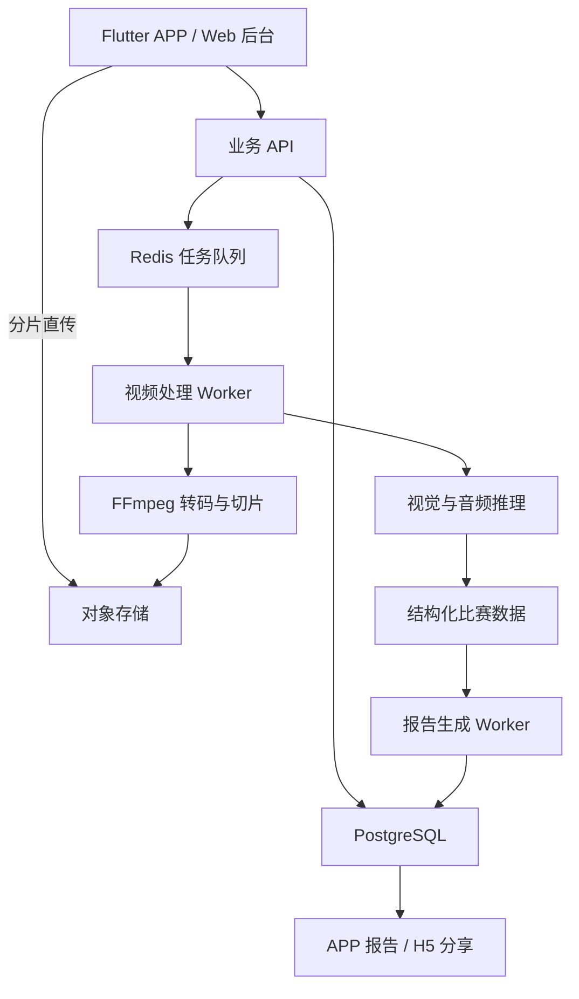
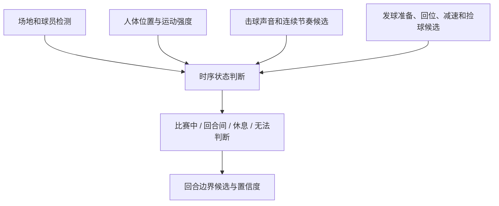

# 羽迹 AI 羽毛球视频剪辑与赛后分析平台｜整体产品方案

创建日期：2026-07-19

状态：立项讨论稿，开发前需完成 CEO 决策项

## 1. CEO 战略判断

羽迹正式从“主要依靠内容提供羽毛球情绪价值的品牌”，升级为“以产品驱动的羽毛球数字成长平台”。

产品不以 AI 为前台主角。用户因为剪辑、复盘和成长价值使用羽迹，AI 是降低视频整理成本、发现比赛信息和生成可信报告的底层能力。

长期愿景：

> 让每一位羽毛球爱好者，都拥有持续生长的数字比赛档案和成长轨迹。

首版产品定位：

> 羽迹是一款面向普通羽毛球爱好者的 AI 视频剪辑与赛后分析产品。用户上传一段比赛或训练录像，获得自动拆分的回合、值得复看的片段和一份有视频证据的分析报告。

价值关系：

> 用户因剪辑和分析而来，因成长档案而留下；Player ID 是长期结果，不是首版使用门槛。

## 2. 目标用户

### 首版核心用户

- 已经会在球场上主动拍摄羽毛球视频的普通球友。
- 手机相册中已有完整训练、单打或双打视频，而不是只有零散高光。
- 希望减少手工找球、切片和整理长视频的时间。
- 对回合数量、有效时长、长回合和多拍回合等客观数据感兴趣。
- 能接受上传和异步处理，不要求即时得到完整结果。

首批用户优先级：

1. 已经主动拍摄完整球局的普通羽毛球球友。
2. 经常录像、需要整理素材的进阶球友和内容创作者。
3. 后续扩展到已有固定监控或摄像系统的球馆。
4. 再后续扩展到需要对比学员多次训练和动作变化的教练。

用户扩展路线：



### 暂非首版核心用户

- 从不录像、也不愿意架设手机的休闲球友。
- 只想约球、找搭子或预订球馆的用户。
- 只观看职业赛事、不记录自己比赛的用户。
- 期待专业生物力学诊断或完全替代教练的高水平运动员。

## 3. 用户问题与产品价值

用户真正的问题不是缺少一个羽毛球 APP，而是：

> 一两个小时的比赛视频太长，整理困难；即使拍下来了，也不知道该看什么、自己打得怎么样、下一次应该重点观察什么。

| 层次 | 用户问题 | 羽迹价值 |
|-|-|-|
| 视频整理 | 找回合、剪片段太费时间 | 自动识别有效比赛区间和回合候选 |
| 信息发现 | 不知道哪些片段值得复看 | 高光、长回合、高强度和问题候选 |
| 赛后理解 | 看了视频仍然依赖模糊感觉 | 基于客观数据和用户确认的证据报告 |
| 长期成长 | 不知道自己是否真的进步 | 多场趋势、成长档案和 Player ID |
| 情绪留存 | 视频最后躺在相册里 | 保存高光、比赛、搭子和热爱痕迹 |

首版必须完整解决前两层，并为第三层提供可信的初步价值。

## 4. 首版价值闭环



首版结果包：

- 自动拆分后的有效回合列表。
- 本段视频总时长和有效打球时长。
- 自动切出的回合数量和片段数量。
- 每个回合的开始时间、结束时间和持续时长。
- 30 秒以上长回合的数量和列表。
- 10 拍以上多拍回合的数量和列表；若击球计数置信度不足，明确标记为估算。
- 最长回合、拍数最多回合和用户收藏片段。
- 单个回合预览、边界微调、删除、合并和拆分。
- 回合片段保存或导出能力的产品预留。

首版先把“长视频稳定切成回合，并给出可信的客观统计”做好。高光自动评分、胜负识别、失误原因、动作评价和复杂 AI 分析报告后置。

## 5. 产品可信度原则

报告中的内容分成三类：

### 已确认事实

- 用户确认的回合边界和胜负标签。
- 视频时长、有效比赛时长和回合时长。
- 用户收藏的高光和问题回合。

### 系统估算

- 击球次数估计。
- 运动强度和高光排序。
- 球员移动范围和粗粒度热区。
- 单打、双打和发球时点候选。

### 分析性建议

- 值得重点复看的回合。
- 下一场建议观察的问题。
- 基于多场数据形成的趋势假设。

语言模型只能根据结构化证据组织表达，不得补写系统未检测到的事实。

首版不承诺：

- 准确追踪高速羽毛球完整轨迹。
- 准确识别所有杀球、吊球、搓球、推球和落点。
- 全自动判断比分、主动得分和失误原因。
- 判断动作是否标准或替代专业教练。
- 仅凭普通单机位准确解释输球的根本原因。

## 6. 用户旅程与信息架构

### 未上传用户

1. 浏览不同类型的授权示例。
2. 打开示例报告。
3. 点击数据和结论，跳转到对应回合。
4. 理解羽迹能做什么和不能做什么。
5. 点击“分析我的视频”。

### 首次上传用户

1. 快捷注册或登录。
2. 从手机相册选择视频。
3. 查看机位、画质、时长、预计处理时间和隐私说明。
4. 后台上传，用户可以离开 APP。
5. 处理完成后收到通知。
6. 确认单双打、关注的球员等必要信息。
7. 快速校正回合列表。
8. 收藏高光，轻量标记赢/输或问题片段。
9. 查看报告并点击证据回放。
10. 保存、分享、导出或上传下一场。

### 首版一级区域

- 首页：价值表达、示例报告、上传入口、拍摄指南、最近任务。
- 上传：视频选择、质量检查、进度、隐私和保留期限。
- 对局工作台：原视频、回合时间轴、片段列表、校正和轻量标记。
- 分析报告：本场摘要、客观数据、关键观察、证据片段和下一场建议。
- 我的：历史任务、报告、额度、账户、隐私和删除；后续生长为 Player ID。

## 7. 首版功能范围

### P0：必须具备

- 授权示例报告库。
- 受邀用户登录。
- 手机相册视频选择。
- 大视频分片上传、断点续传和失败重试。
- 上传、转码、识别、确认、报告等任务状态。
- 处理完成通知。
- 视频质量预检和分析等级提示。
- 自动识别有效比赛区间和回合候选。
- 回合缩略图、列表和连续播放。
- 删除、合并、拆分和边界微调。
- 高光收藏。
- 视频总时长、有效打球时长、回合数和片段数。
- 30 秒以上长回合统计。
- 10 拍以上多拍回合估算，并展示置信度。
- 最长回合和拍数最多回合。
- 以客观统计和回合列表为主的首版结果页。
- H5 报告分享。
- 用户反馈：识别错误、结论无用、结论有帮助。
- 原视频、衍生片段、报告和账户数据删除。
- Web 运营后台导入授权种子视频、校正结果、审核报告和重跑任务。

### P1：首版跑通后

- 回合片段导出和批量下载。
- 更可靠的逐回合击球次数和粗粒度移动热区。
- 高光自动评分和智能成片。
- 胜负、比分和问题回合的辅助识别。
- 带视频证据的赛后观察和训练建议。
- 多场趋势比较。
- 单打、双打差异化报告。
- 月度成长总结。
- Player ID 基础页。
- 教练可查看和批注的分享报告。
- 小程序报告和邀请入口。

### P2：中长期

- 部分球路和高价值事件识别。
- 双打轮转和搭子协作分析。
- 个性化训练建议。
- 球馆摄像头和多机位接入。
- 教练、俱乐部和赛事账户。
- 年度羽迹档案。
- 数字记录衍生的实体纪念产品。

### 首版明确不做

- 社区信息流和公共用户视频库。
- 约球、球馆预订和赛事组织。
- 商城和装备推荐。
- 没有证据约束的 AI 教练聊天框。
- 全自动专业动作纠错。
- 复杂 Player ID 资料填写。
- 同时开发独立原生 iOS、原生 Android、小程序和完整 Web 工作台。

## 8. 客户端与工程架构

### 客户端建议

| 客户端 | 首阶段定位 |
|-|-|
| Flutter APP | 视频选择、后台上传、任务进度、回合校正、完整报告 |
| H5 / Web | 示例报告、外部分享、邀请注册、隐私政策 |
| Web 运营后台 | 种子视频导入、授权记录、任务重跑、人工校正和报告审核 |
| 微信小程序 | 后续承担分享和拉新，不作为首版长视频工作台 |

正式确定 Flutter 前，必须用原型验证 iOS 和 Android 的大视频后台上传、失败恢复和通知链路。必要时为关键上传能力增加原生模块。

### 后端建议



第一阶段采用模块化单体：

- Python + FastAPI 业务 API。
- PostgreSQL 业务和结构化分析数据。
- Redis + Celery 或 Dramatiq 异步任务。
- FFmpeg 转码、切片、缩略图和媒体检测。
- PyTorch 或 ONNX Runtime 视觉与音频推理。
- 单一国内云厂商的 S3 兼容对象存储。
- CPU 视频处理节点和按需 GPU 推理节点。

第一阶段不使用 Kubernetes，不建设多云和大量微服务。

## 9. 回合检测技术路线

旧方案只识别发球动作，容易受到遮挡、机位和动作幅度影响。首版采用多信号时序融合：



第一阶段优先使用规则、滑动窗口、状态机和轻量时序模型，不在数据不足时训练昂贵的端到端整场视频模型。

### YOLO 的定位

YOLO 可以作为场地内人员、球员和羽毛球候选检测能力之一，但不作为首版唯一判断依据。

- 人体检测相对成熟，可用于判断场内人数、位置、运动状态和单双打候选。
- 羽毛球目标很小、速度快、运动模糊明显，普通球馆视频中容易漏检。
- 单打和双打都可以纳入首版，但人数、遮挡、轮转和运动分布不同，仍需要保留比赛类型信息用于阈值和评测分层。
- 十拍以上统计不能简单等同于 YOLO 检测到羽毛球多少次；应融合击球声音、人体挥拍节奏、球体候选轨迹和时序去重。
- 当拍数估算不可靠时，产品必须显示置信度或只给出“疑似多拍回合”，不能把估算写成确定事实。

## 10. 视频处理与任务状态

处理链路：

1. APP 读取文件大小、时长、分辨率、编码、帧率和文件指纹。
2. 通过对象存储原生 Multipart Upload 分片直传。
3. FFmpeg 生成保留音频和时间映射的分析代理视频。
4. 低分辨率、低帧率扫描全片。
5. 对关键窗口做更高精度复核。
6. 输出回合候选和置信度。
7. 用户使用代理视频快速校正。
8. 确认后生成正式片段和结构化报告。
9. 按用户选择保留或删除原视频。

任务状态：

```text
等待上传 → 上传中 → 文件校验 → 转码中 → 回合识别中
→ 生成片段 → 等待用户确认 → 生成报告 → 已完成
```

必须支持失败重试、从失败步骤继续、取消任务、后台重跑、算法升级后重新分析和重复视频检测。

## 11. 数据、评测与数据飞轮

### 第一批数据目标

- 100—200 段合法授权的完整视频。
- 3000—5000 个真实回合。
- 至少 20 个球馆。
- 至少 6 种典型机位。
- 覆盖单双打、横竖屏、不同水平、画质、遮挡和音频条件。

### 标注层级

- 视频级：类型、机位、画质、场地可见度、音频可用度和分析等级。
- 时间段级：回合、回合间隔、长休息、无效镜头和无法判断区间。
- 回合级：起止、完整性、置信度、高光候选和用户修正。
- 高级标注：球路、得失分原因和动作质量后置。

### 评测方式

训练、验证和测试必须按拍摄者或球馆拆分，避免同一机位泄漏造成虚假高分。

建立三套评测集：

- 标准集：固定后场机位、场地完整。
- 真实集：普通用户常见画质与遮挡。
- 困难集：移动镜头、竖屏、多场地和严重噪声。

首版标准机位探索性目标：

- 回合召回率约 90%。
- 回合精确率约 85%。
- 大部分边界误差不超过 2 秒。
- 用户确认 30 分钟视频不超过 5 分钟。
- 相比手动整理节省 70% 以上时间。

### 人工校正数据

保存模型原始结果、模型版本、原始置信度、用户最终结果、修改差异、视频条件和模型优化授权。

优先复核：低置信度、用户高频修改、信号冲突、新球馆新机位和模型版本差异大的样本。用户编辑不能未经复核直接当成训练真值。

## 12. 冷启动和种子内容

未经授权的公开视频、职业赛事和社交平台视频不得下载后重新托管、剪辑或用于训练。

种子来源优先级：

1. CEO 自己拍摄的视频。
2. 球友书面授权的视频。
3. 体验官和内容创作者明确授权的视频。
4. 球馆、俱乐部和赛事方合作素材。
5. 许可证明确允许处理和展示的公开视频。

授权拆分为：

- 仅完成本次分析。
- 允许内部算法改进。
- 允许匿名公开展示。
- 允许实名公开展示。
- 允许商业宣传。

默认不勾选模型训练和公开展示。

### 示例报告库

准备 8—12 个真实授权示例，覆盖初级双打、进阶双打、单打、训练多球、横竖屏、不同光线和拍摄距离。示例必须标明自动结果、人工修正和能力限制，避免用精修样例制造落差。

### 100 场种子视频计划

- 10 场内部基准集：自有视频，定义报告和评测。
- 30 场封闭测试集：熟人球友和固定体验官。
- 60 场真实试用集：通过小红书、俱乐部和创作者招募。

种子用户获得免费剪辑、报告和优先体验；羽迹获得分层授权、真实反馈和经许可的数据。

## 13. 隐私与数据删除

- 用户视频默认私有。
- 上传前明确处理方式和保存期限。
- 分享链接可关闭并可设置有效期。
- 原视频、代理视频、片段、报告和账户数据均支持删除。
- 对象存储使用短期签名 URL。
- 管理员访问需要权限和审计。
- 模型训练必须独立授权。
- 不使用人脸进行身份识别。
- 多人出镜时提醒上传者确认必要授权。
- 原视频可选择分析完成后自动删除。

## 14. 单场成本与商业化

上线前必须测清：

- 每分钟视频分析成本。
- 每小时原视频存储成本。
- 每份报告的大模型调用成本。
- 视频播放和导出流量成本。

降本方式：客户端按需压缩、代理视频分析、低帧率全片扫描、关键窗口高精度复核、GPU 批处理、确认后再生成高清片段、中间文件自动清理和原片生命周期。

初期商业模式建议：

- 免费示例和首次短视频体验。
- 单场分析付费。
- 视频时长额度包。
- 高频用户订阅，包含月度额度、历史趋势和优先处理。
- 创作者版，提供更多导出、批处理和无水印能力。
- 后续教练或俱乐部版。

首版不提供低价无限量订阅。

## 15. 核心指标

北极星指标：

> 每周完成有效分析，且用户实际查看过报告证据片段的比赛数量。

关键指标：

- 示例报告到上传转化率。
- 上传完成率和处理成功率。
- 回合检测有效率。
- 人工校正次数和耗时。
- 报告打开率和证据片段点击率。
- 保存、分享和导出率。
- “结论有帮助”比例。
- 30 天内第二次上传率。
- 单场完整处理成本。

首轮 30 名用户的探索性门槛：

- 70% 以上上传任务成功完成。
- 80% 以上任务生成可用回合列表。
- 中位人工校正时间不超过原视频时长的 10%。
- 60% 以上用户至少点击 3 个证据片段。
- 30 天第二次上传率达到 30%。
- 至少 20% 用户主动分享、导出或询问下一次使用。

## 16. 0—1 推进阶段

### 阶段 0：产品定义与理想报告，约 2 周

- 使用 3—5 场自有或授权视频，人工制作不同深度的理想报告。
- 访谈目标用户，选出最有价值的三类结果。
- 明确回合定义、标注规范和最低可接受准确度。
- 验证 Flutter 大视频后台上传和通知链路。
- 估算 30、60、90 分钟视频的单场成本。

交付：理想报告原型、技术能力地图、标注规范、客户端验证和成本模型。

### 阶段 1：内部处理流水线，约 3—4 周

- Web 后台导入授权视频。
- 转码、自动回合候选、人工校正、切片和结构化报告。
- 建立任务状态、失败重试、授权记录和删除能力。
- 稳定制作 10 份真实示例报告。

### 阶段 2：邀请制 APP，约 4—6 周

- 登录和邀请码。
- 手机视频选择、分片上传和断点续传。
- 任务中心和完成通知。
- 回合浏览、快速校正和轻量标记。
- 报告查看、证据回放和数据删除。
- 邀请 10—30 位种子用户。

### 阶段 3：分享与有限公测，约 2—3 周

- H5 报告和隐私分享控制。
- 示例报告首页。
- 免费额度、限流、成本监控和用户反馈。
- 开启 100 场种子视频计划。

## 17. 开发前 CEO 决策项

当前决策状态：

1. 已决策：首版同时支持单打和双打，并按比赛类型分层评测。
2. 已决策：首版服务已经主动拍摄完整视频的普通球友；球馆和教练分别作为后续扩展阶段。
3. 已决策：首版优先回答视频总时长与有效时长、切出多少回合、30 秒以上和 10 拍以上回合有多少。
4. 已由团队确定：首版不要求用户标记赢/输；必要交互只有回合边界修正、拍数修正和收藏。
5. 已由团队确定：推荐固定后场中线、横屏、1080p、30fps 和现场音频；最低接受 720p、24fps。
6. 已决策：首版支持单回合下载和多回合异步打包下载。
7. 已由团队确定：原视频默认保存至分析完成后 7 天；用户可选择立即删除或延长至 30 天。已生成片段和结果默认保存 30 天，后续由套餐调整。
8. 待技术原型测算：第一阶段单场处理成本上限，不能在没有真实数据时拍脑袋确定。
9. 待开发立项前确定：国内云厂商、域名备案和 APP 上架路线。
10. 待开发立项前完成：种子视频授权、隐私协议和未成年人视频规则。

当前仍需继续讨论的关键问题：

- 已决策：一个回合从发球动作开始，到羽毛球落地或本球成为死球为止；捡球、喝水、换人、换场和休息都不进入回合。
- 已决策：发球直接下网、出界或无人接到也算独立完整回合。
- 已决策：单打、双打、普通练球和热身沿用相同单球定义；多球训练作为相同原则下的独立技术模式评测。
- 已决策：首版必须支持下载单个回合片段。
- 已决策：回合完整度与拍数可信度分别判断；精确拍数直接显示，存在可补全的短暂漏检时显示“约 N 拍”或“疑似 N 拍以上”，无法唯一还原时不展示具体拍数。
- 已决策：首版不自动分局和识别比分；一个上传文件作为一个视频项目，回合按出现顺序连续编号，用户只需为项目命名。
- 已决策：原视频原样上传，分析使用代理视频，最终片段从原视频生成并保持原分辨率、帧率、方向和音频，不做主动画质增强。
- 已由团队确定：推荐固定后场中线、横屏、1080p、30fps 和现场音频；最低接受 720p、24fps；首版单文件最长 90 分钟、最大 6GB，按真实处理效果再调整。

详细规则见：`docs/yuji-company/products/yuji-rally-definition-and-clipping-rules.md`。

## 18. 当前立项结论

羽迹首版应交付：

> 一段杂乱的羽毛球长视频，进入羽迹后变成一组可浏览、可修正、保持原画质并可下载的独立回合，同时给出有效时长、回合数、30 秒以上长回合和 10 拍以上多拍回合等可信统计。

开发不会立即开始。下一步先制作首版页面与用户流程方案、真实切片样例和技术验证原型；确认切片效果、拍数可信度、处理时间和单场成本后，再拆分正式 PRD、技术设计和开发计划。
